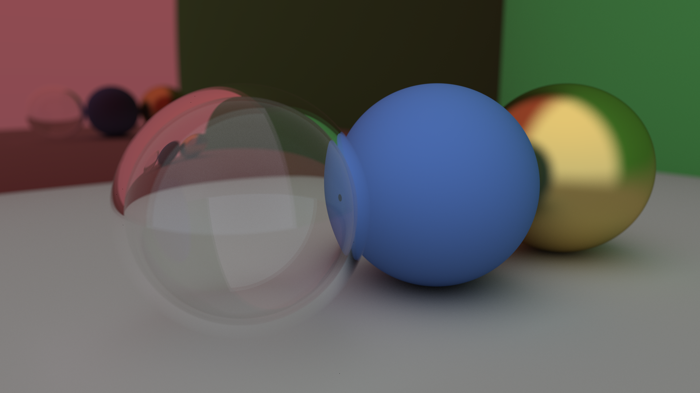
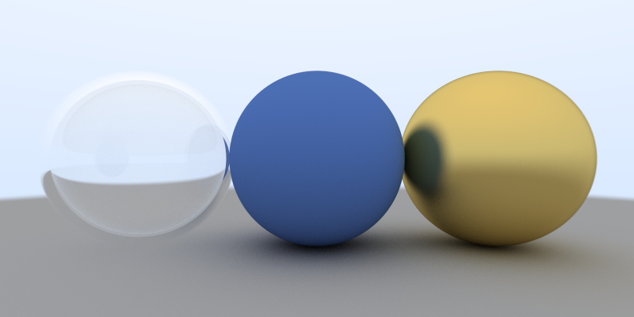

# Raytracer
Simple C++ raytracer inspired by [Peter Shirley](https://github.com/petershirley/raytracinginoneweekend).

<p align="center">  
  
</p>

# 3rd party libraries
For a `BMP` handling, [stb_image_write.h](https://github.com/nothings/stb) is used.

# Features
Supported geometry
- Spheres

Supported material
- Lambertian
- Dielectric
- Metal

Scene
- Variable size
- Variable number of the rays per pixel
- Customizable camera
- Two predefined scenes for fast usage

# Screenshots
Scene 0, 800 x 400, 1000 rays per pixel:

<p align="center">  
  
</p>

Scene 1, 800 x 400, 1000 rays per pixel:

<p align="center">
  
</p>

`Scene` can be selected via its assigned number as follows:

```cpp
Scene scene(&image); // image to be rendered to

scene.init(&cam, ns); // camera and number of rays per pixel
scene.setupDemoScene(0); // id of the predefined scene
scene.render();
```
